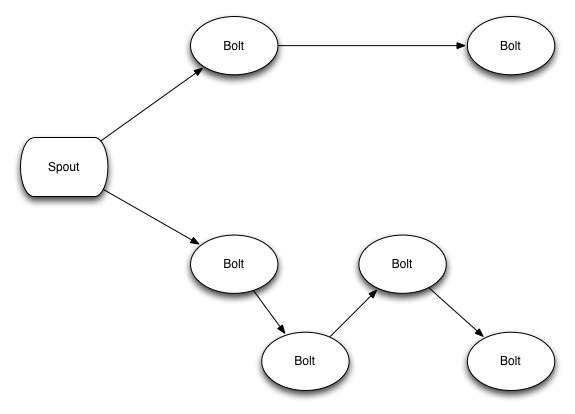
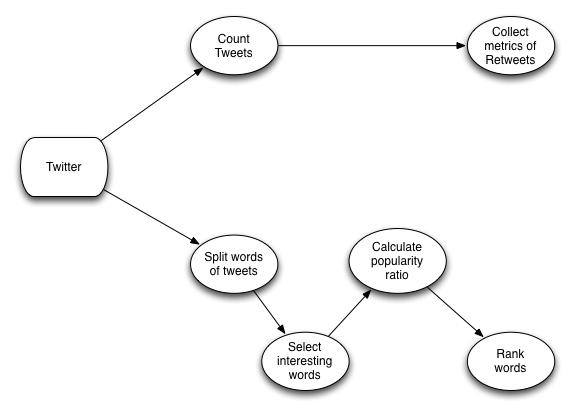

### Ruby and Big Data

Ari Lerner, <a href="http://fullstack.io">fullstack.io</a>

!

## TOC

1. Ruby
2. Big Data
3. Demo

!

## Ruby

A beautifully expressive language written by Yukihiro Matsumoto (aka Matz)
that we all appreciate, _presumably why we are all here_

!

## Big Data

!

## What is it

!

<em>Buzzword</em>

!

The amount of data that is flowing through the `pipes` of the internet is
enormous. Spend a lot of time gathering data, storing it, retrieving it...
databases, etc. We are so innundated and intertwined with technology, that the
amount of data generated often goes untapped.

!

## My definition

`Big data` is about creating experiences that allow us to make sense of all of
it

!

## Making sense of it

* When?
* At what scale?
* How much do we need?
* Why even bother?

!

## Why even bother?

!

* Recommendations
* Predictions
* Save the planet

!

### Big Data implementation

* Map-Reduce, batched
* Realtime, streaming

!

### Enough of the pie-in-the-sky

!

## Demo

`git clone git://github.com/auser/rigdata.git`

!

## Architecture

`git clone git://github.com/auser/rigdata.git`

* [Jruby](http://jruby.org/)
* [Storm](http://storm-project.net/)
* [Redis](http://redis.io/)

!

### JRuby

Java is the language of the data-scientist and the JVM has countless smart
brains making it fast and providing many many libraries

!

### Storm

A distributed realtime computation system written by Nathan Marz at Twitter
written in [Clojure](http://clojure.org/) (I also really like clojure)

!

### Redis

A lightning-fase advanced key-value store (with both in-memory and persistent
data)

!

### Demo?

!

#### Realtime twitter firehose data-wrangler

!

### Incredibly quick 2-slide Storm overview

!

Topologies in Storm are like Map-Reduce jobs in Hadoop. Instead of scheduling
and processing large-scale datasets, it continuously processes them.

!

## Primitives

* `Spouts` emit data (can be any number of data sources, like twitter firehose, kestrel queue, redis, etc).
* `Bolts` process data and pass the data on

!

# Storm topology

!

# Demo topology

!

## Frontend

Our demo pulls tweets from the firehose and pumps them through our topology. At
the very end, the topology will store the processed message in Redis. The
front-end subscribes to the redis queue and reacts when the queue changes.

!

## Keyboard time

!

## Questions?

!

## The extra

All code is available at:

[github.com/auser/rigdata](https://github.com/auser/rigdata)
